# BikeFit - User Flows

Version 1.1 | 2026-07-04 | Canonical source of truth for flows. Build every branch and every empty/loading/error/offline state shown here. When a flow's behaviour changes, update its diagram in the same PR. A flow that doesn't match the build is a defect.

---

## Flow 0: App map

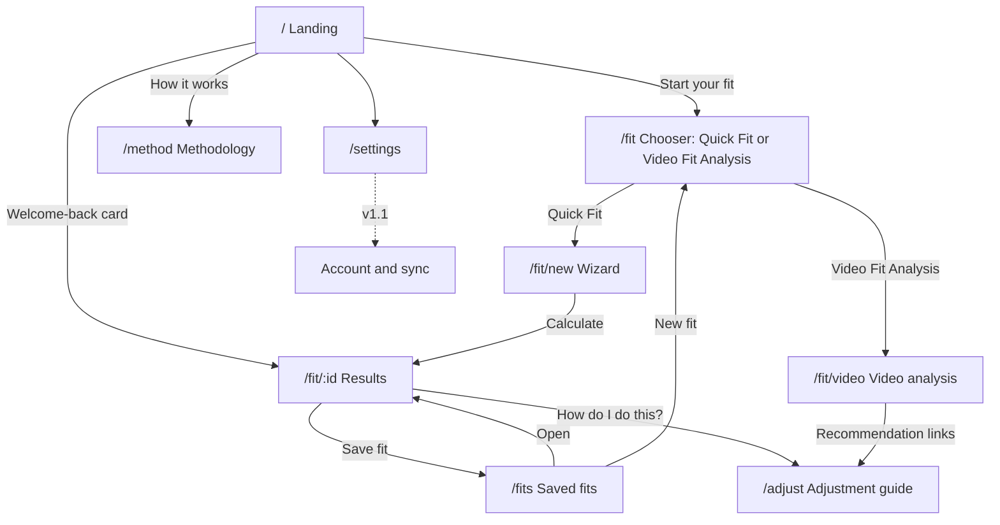

---

## Flow 1: First-time visitor to completed fit (the golden path)

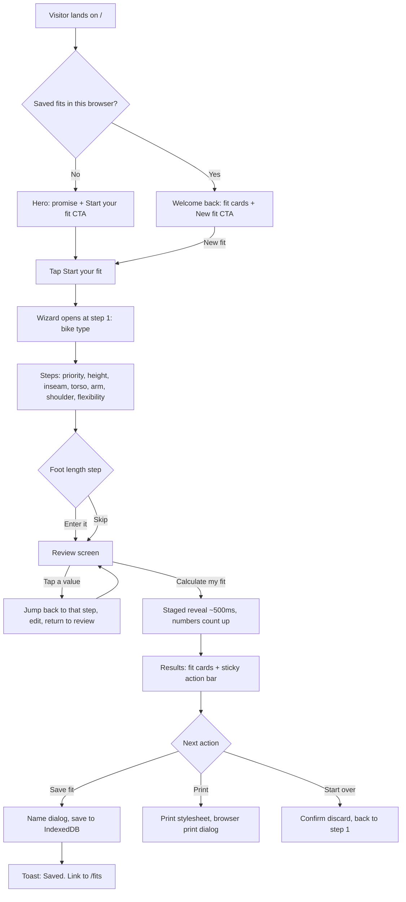

State requirements: wizard draft persists to IndexedDB on every step (refresh-safe); Back never loses data; reveal animation replaced by instant render under `prefers-reduced-motion`.

---

## Flow 2: Measurement step (repeats per measurement)

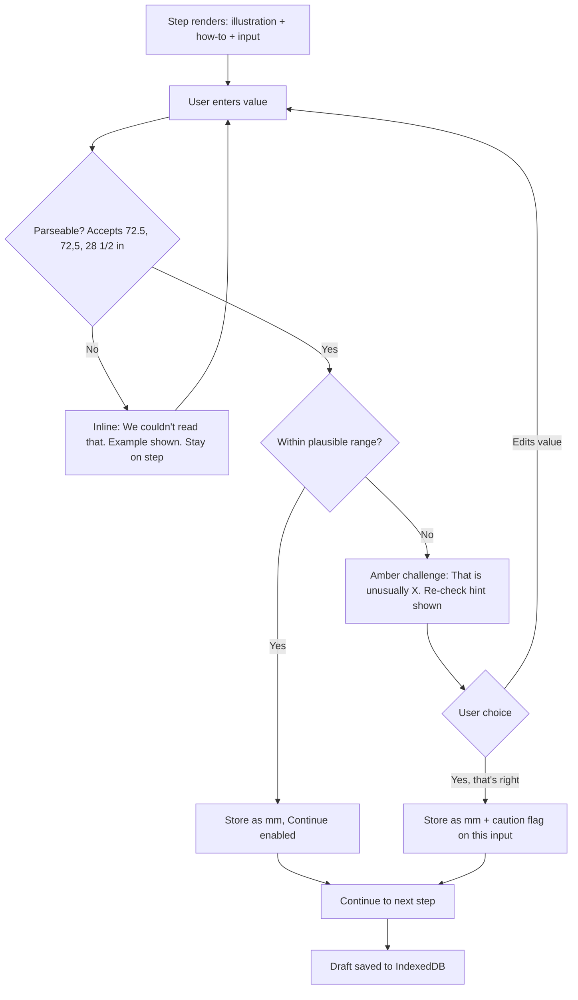

Rules: validate on blur, never on keystroke. Challenge, never hard-block (0 counts and edge values are the user's call). Caution flags carry through to the fit sheet as a CautionBanner.

---

## Flow 3: Results interaction

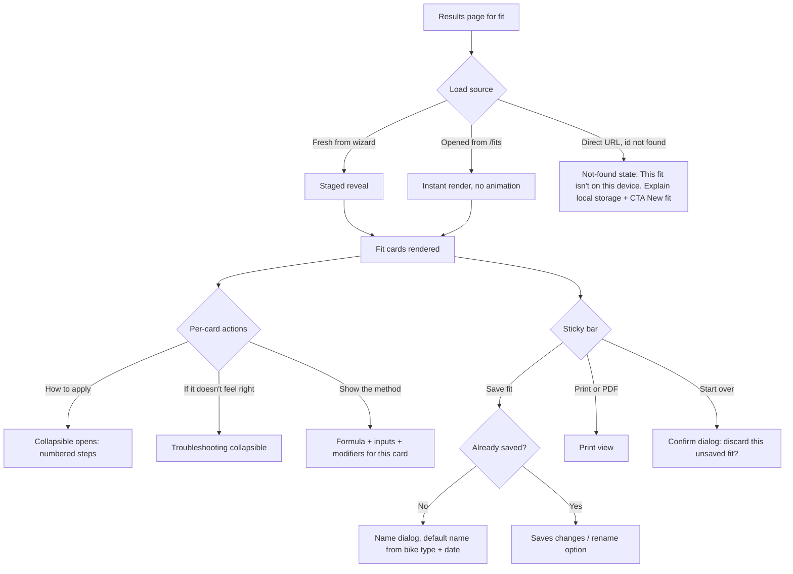

---

## Flow 4: Saved fits (garage)

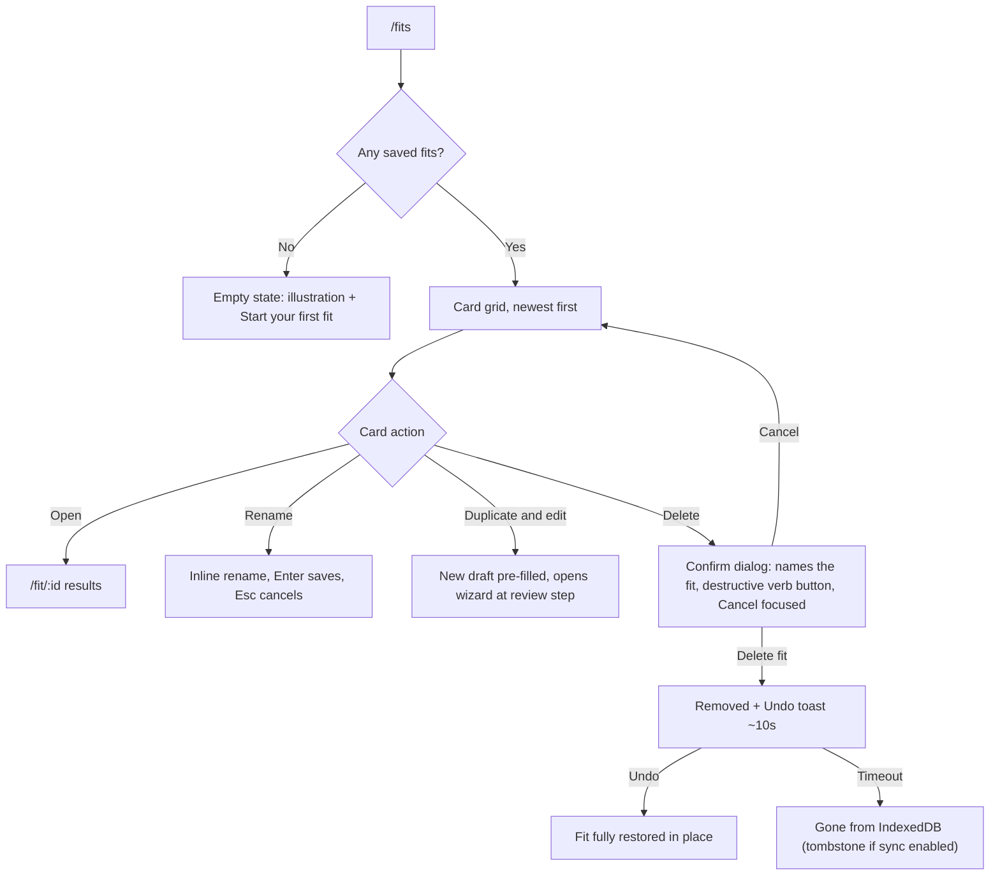

Delete rule is universal: every destructive action in the app follows this exact confirm + undo pattern via the one shared `useConfirmDelete` utility.

---

## Flow 5: Units and theme

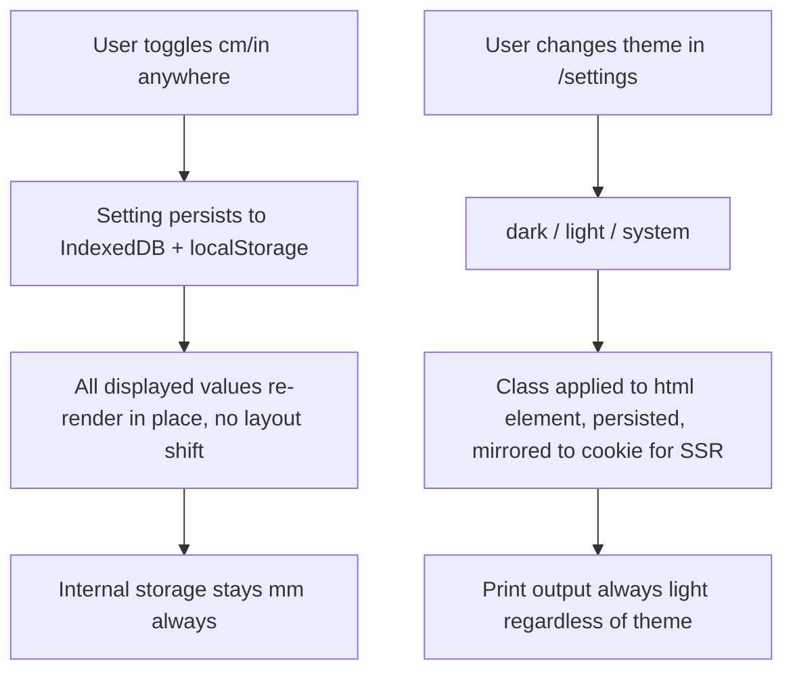

---

## Flow 6: Export, import, erase (data controls)

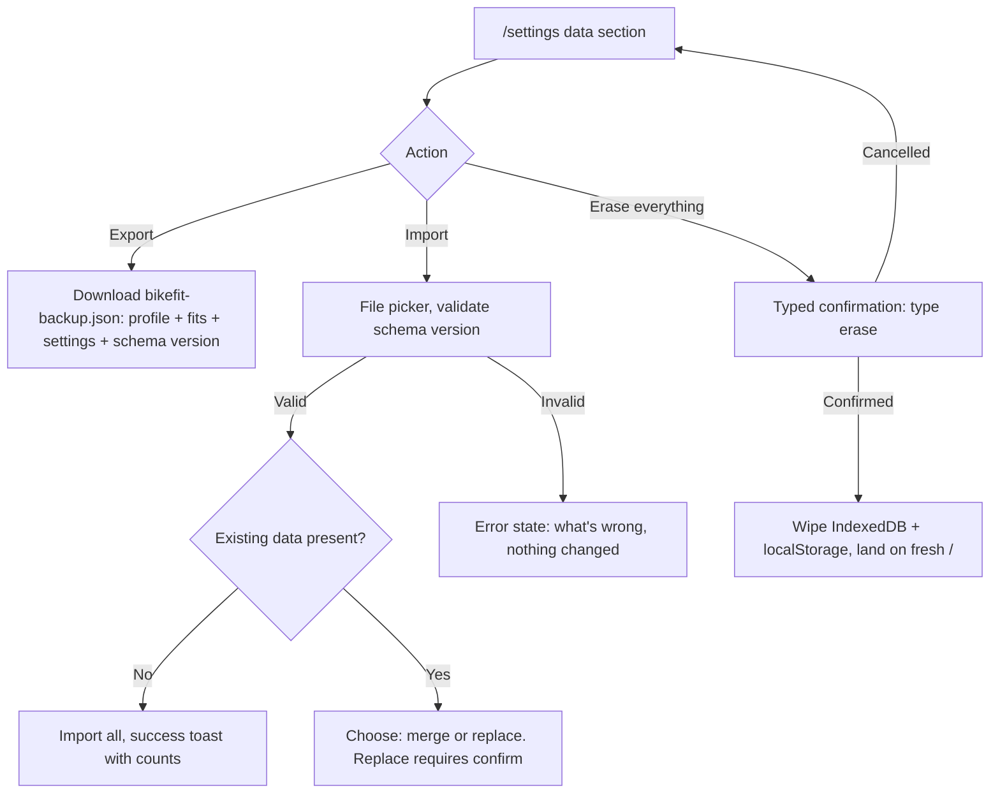

---

## Flow 7: Optional account sync (v1.1)

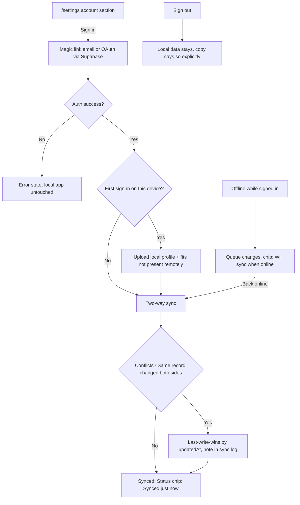

Never blocks: every feature works signed-out. Sync failures degrade to local-only with a status chip, never a modal.

---

## Flow 8: Offline and error handling (cross-cutting)

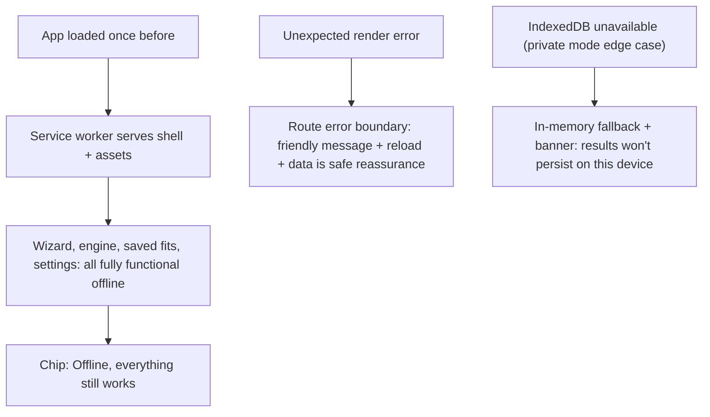

Exception: Video Fit Analysis needs network on its FIRST use per device (the pose model downloads from a public CDN, cached afterward). The rider's video itself never leaves the device. See Flow 9.

---

## Flow 9: Video Fit Analysis (side view, required)

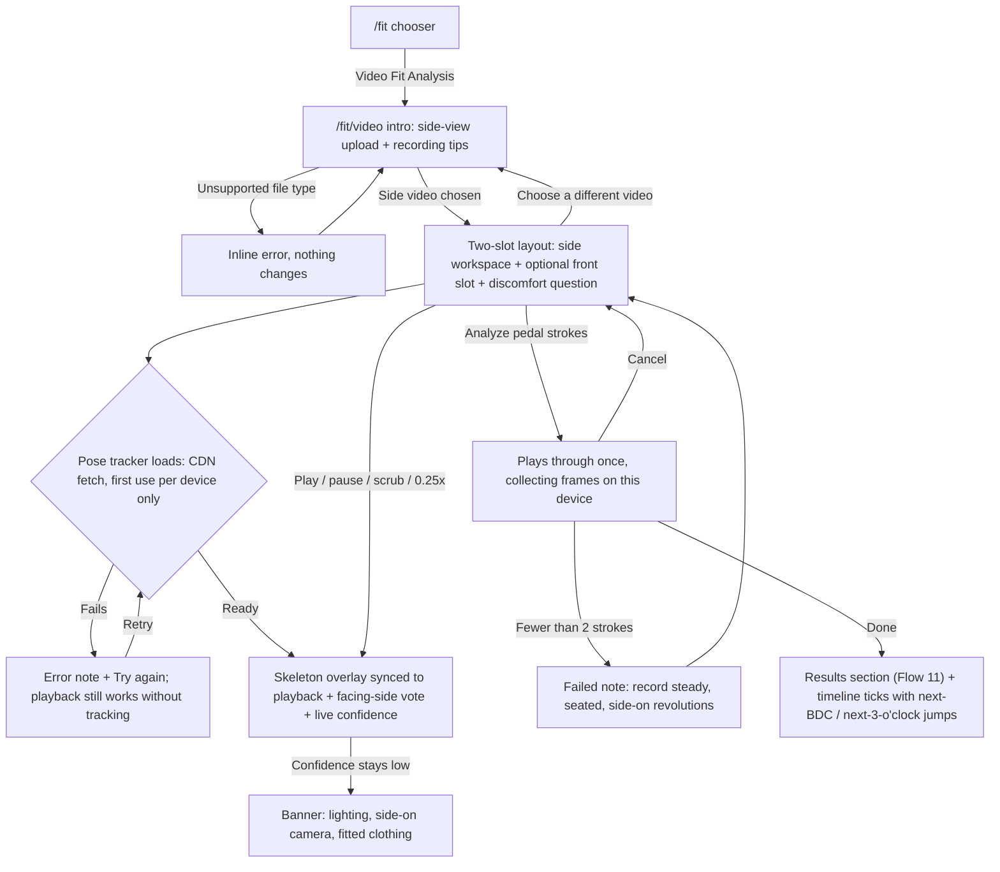

Rules: the video file is NEVER uploaded anywhere (no fetch/XHR of it, no server route). Analysis caps at 60 s / 3600 frames. The wizard-side rules (never hard-block, non-blaming copy) apply throughout.

---

## Flow 10: Front or rear view (optional companion)

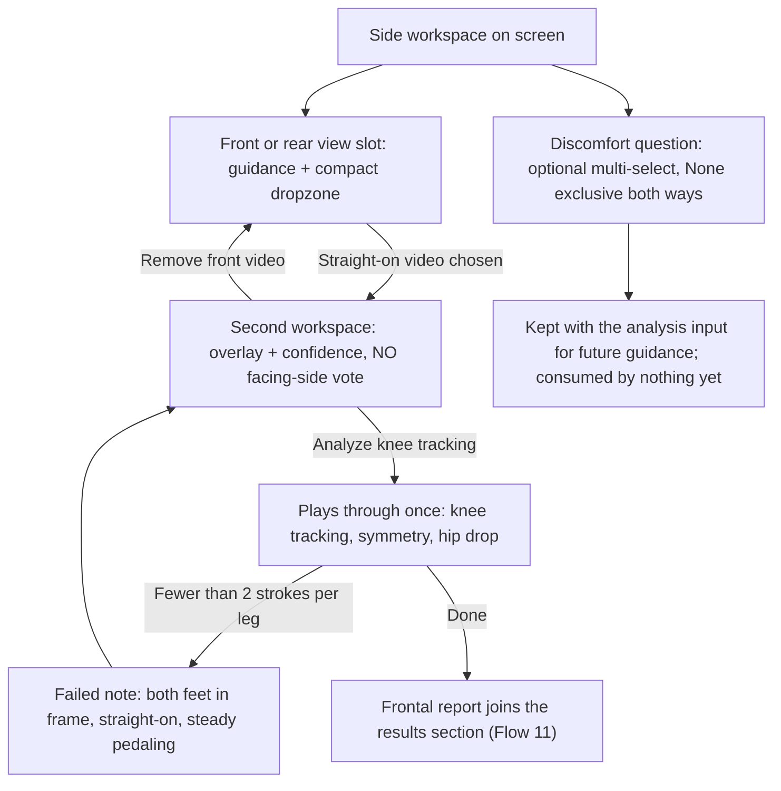

Rules: facing-side detection never runs on a straight-on view (it assumes one side is occluded). Each on-screen video owns its own pose-landmarker instance.

---

## Flow 11: Video results and recommendations

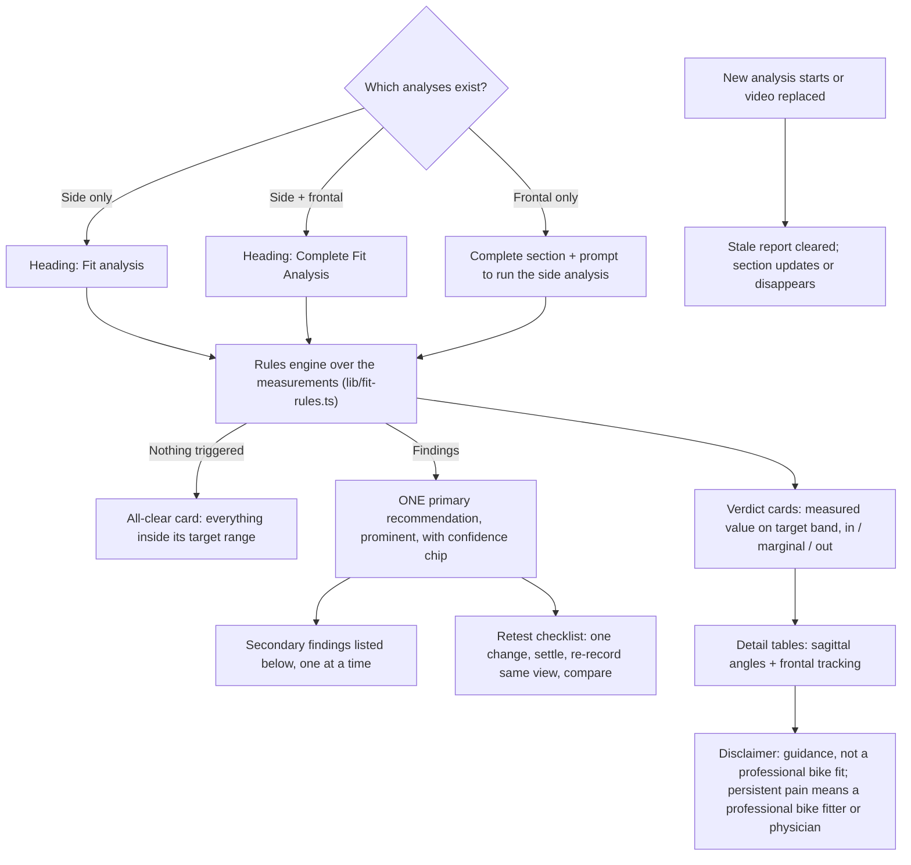

Rules: one change at a time (single primary, rest secondary; deterministic by priority then rule order). Every target range and magnitude in `lib/fit-rules.ts` is a PLACEHOLDER pending owner-confirmed values; no session may tune them silently.

---

## Flow 12: Tip jar (zero pressure)

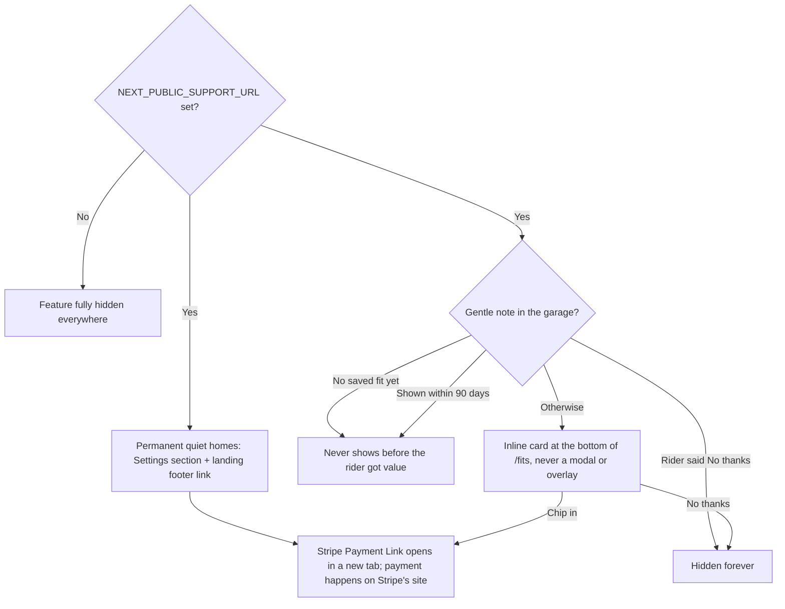

Rules: nothing is ever gated on giving, the copy says so, and nothing about showing, dismissing, or giving is tracked or logged. The softness rules are unit-tested (lib/support.test.ts).

---

## Flow 13: Adjustment guide

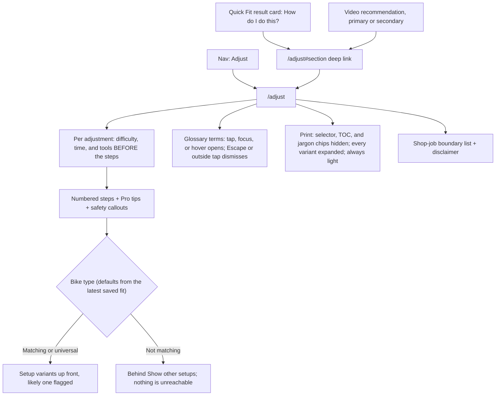

Rules: torque discipline is absolute: the app teaches riders to find the printed spec and use a torque wrench, and NEVER states a numeric torque value (enforced by lib/adjustments.test.ts). All definitions come from lib/glossary.ts, single source. Recheck-style video findings (re-record, in-person assessment) carry no wrench link by design.
