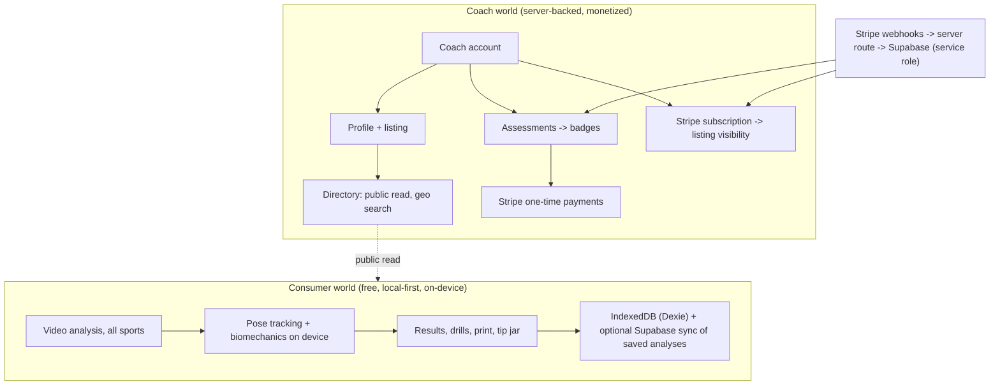

# SportFit - Architecture

Design only. How BikeFit's working code becomes a multi-sport platform with
the least waste and the clearest seams. Read [00-Vision.md](00-Vision.md) first.

---

## 1. The core idea: a shared analysis kernel + per-sport modules

Everything already in `lib/` and `components/fit/` splits into two piles:

**The kernel (sport-agnostic, reused as-is or lightly generalized):**
- `lib/pose-landmarker.ts` - MediaPipe wrapper. Already sport-neutral. No change.
- `lib/pose-model.ts` - landmark topology + generic helpers. No change.
- Generic geometry in `lib/biomechanics.ts` (interiorAngleDeg, torsoAngleDeg,
  movingAverage, computeStats, facing-side/confidence helpers). Move these to
  `lib/kernel/geometry.ts`; they belong to every sport.
- The video UI: upload/dropzone, playback controls, skeleton overlay canvas,
  confidence banner, key-frame timeline markers, the results shell (verdict
  cards, one-change-at-a-time recommendations, retest checklist, disclaimer),
  the glossary component, print styles. Generalize the copy hooks; keep the
  behavior.
- The rules-engine *shape* (`verdictFor`, target ranges with margins,
  priority-ordered findings, one primary + secondary). The engine is generic;
  only its data (targets, rules) is per-sport.

**A sport module (one folder per sport) provides the data and specifics:**
- Its **biomechanics extractors**: which joints/angles/events this sport
  cares about, and how to segment the video into meaningful units (pedal
  strokes, running strides, lift reps, or one-shot swing phases).
- Its **targets and rules** (all placeholder numbers, expert-confirmed later).
- Its **copy, glossary terms, and drill/adjustment guide**.
- Its **key-frame definitions** (what moments to mark on the timeline).
- Its **camera guidance** and **capture views** (e.g. side + front).
- Optional **non-video tools** (cycling's measurement-based Quick Fit is one;
  most sports have only video).

### The module contract (a sketch, not final code)

```
lib/sports/<sport>/
  index.ts        // export the SportModule descriptor
  biomechanics.ts // pure extractors over pose frames -> a report
  rules.ts        // targets + rules (PLACEHOLDER numbers)
  copy.ts         // headings, recommendations text, glossary ids
  drills.ts       // the adjustment/drill guide catalog
```

A `SportModule` descriptor names the sport, its accent color, its capture
views, its analyzers, and the functions above. A central registry
(`lib/sports/registry.ts`) lists every module. The hub, the router, and the
directory's sport filters all read from the registry, so **adding a sport is
adding a folder and one registry line**, never touching the kernel. Adding a
new lift within weightlifting is even smaller: a config entry inside the
weightlifting module (the same way bike variants are config today).

## 2. What "generalize" concretely means for existing files

| Today | Becomes |
|---|---|
| `lib/biomechanics.ts` (generic geometry + bike stroke segmentation + bike report) | `lib/kernel/geometry.ts` (generic) + `lib/sports/cycling/biomechanics.ts` (bike-specific) |
| `lib/fit-rules.ts` | `lib/sports/cycling/rules.ts` using a generic `lib/kernel/rules.ts` engine |
| `lib/adjustments.ts`, `lib/glossary.ts` | cycling's `drills.ts` + a shared glossary the kernel owns, sports contribute to |
| `components/fit/video-workspace.tsx` etc. | `components/kernel/*` (shell) parameterized by the active `SportModule` |
| `app/fit/*` (cycling routes) | `app/[sport]/*` dynamic routes driven by the registry, with `app/fit` kept as a cycling alias/redirect so existing links and the Play deep link survive |

The golden-test discipline carries: each sport's rules and biomechanics get
their own vitest suites with synthetic-landmark fixtures, exactly as
`lib/biomechanics.test.ts` and `lib/fit-rules.test.ts` do now.

## 3. The two-world split: local-first consumer vs server-backed directory

BikeFit's rule was "local-first, no required server, static-export-friendly."
That rule **stays true for the entire consumer experience** and **breaks, on
purpose, only for the coach directory and payments**, which genuinely need a
server and a shared database.



- **Consumer analysis**: unchanged philosophy. Video never uploaded. Works
  offline after first load. No account required.
- **Directory reads** (finding a coach) are public and can be cached/served
  statically or via light server reads; a signed-out user browsing coaches
  needs no account.
- **Coach writes, payments, badge state**: real server. Next.js route handlers
  / server actions, Supabase with strict RLS, Stripe webhooks verified on the
  raw body and applied with the service role (never trust the client to set
  its own subscription or badge state). This mirrors the DamageIQ security
  posture the team already knows.

## 4. Data model (server side, overview)

Tables (all with RLS; `auth.uid()` scoping; see doc 03 for policy detail):

- `coaches` - one per coach account: display name, bio, sports, service area
  (geo), contact/booking link, photo. Public-readable when listing is active.
- `coach_listings` - subscription-driven visibility: status, current period,
  Stripe subscription id, city/region, lat/lng for search.
- `assessments` - the quiz definitions per sport and tier (Certified/Pro).
- `assessment_attempts` - a coach's attempts, score, pass/fail, timestamp,
  Stripe payment id. Answers are private to the coach + server.
- `badges` - issued credentials: coach, sport, tier, issued_at, and for Pro
  the CE attestation state and next-due date.
- `ce_attestations` - annual self-reported continuing-education records.

Consumer side keeps the existing Dexie schema; saved analyses generalize from
"fits" to "analyses" carrying a `sport` field. Sync (Supabase) extends the
existing pattern.

## 5. Payments: three distinct Stripe flows

1. **Tip jar** (exists): Stripe Payment Link, consumer, web-only, hidden in the
   Play wrapper. No change.
2. **Assessment fee**: one-time Stripe Checkout, coach pays to attempt an
   assessment. Server verifies payment before unlocking the attempt.
3. **Directory subscription**: Stripe Billing (recurring). A webhook flips
   `coach_listings.status`; the listing shows only while active. Cancel or
   lapse hides the listing but never deletes the coach's account, badges, or
   data.

All three are B2B/consumer *web* transactions. Note the Play-billing question:
the coach flows should be **hidden in the Play-wrapped app** (same `?src=play`
mechanism already built for the tip jar), so the Android app stays a pure free
consumer tool and clear of Play's in-app-purchase policy. Coaches manage
everything on the website. Doc 03 and doc 05 carry this constraint.

## 6. Routing and information architecture

```
/                         Main hub: pick your sport (+ what SportFit is)
/cycling                  Sport home: choose an analysis + drills + find a coach
/cycling/fit/new          Cycling Quick Fit (existing measurement wizard)
/cycling/video            Cycling video analysis (existing)
/running, /running/video  etc. per sport, driven by the registry
/<sport>/drills           The sport's adjustment/drill guide
/coaches                  Directory: search by sport + location
/coaches/[id]             A coach's public profile
/for-coaches              Marketing + how to get listed and certified
/dashboard                Coach's private area: profile, assessments, billing
/method, /privacy, /settings   Shared, as today
```

`/fit/*` stays as a redirect to `/cycling/*` so nothing already shipped
(including the Play deep link and any shared links) breaks.

## 7. Non-negotiables that carry over (from CLAUDE.md, extended)

- Pose/video processing stays 100% client-side; the video is never uploaded.
- Pure biomechanics and rules live in testable modules with golden tests; no
  React/DOM in them. Every threshold is a `// PLACEHOLDER` until expert-confirmed.
- Design tokens only; both themes; all controls from `components/ui/*`.
- Universal delete rule (confirm + undo) applies to coach data too.
- Server security: RLS on every table, `SET search_path`, re-check auth in
  every SECURITY DEFINER function, verify Stripe webhooks on the raw body,
  service-role client server-only. Never trust the client for subscription or
  badge state.
- No em dashes anywhere, including code comments. (Voice specifics in doc 04.)

Phase 0 of the build plan updates the repo's CLAUDE.md to encode these.
