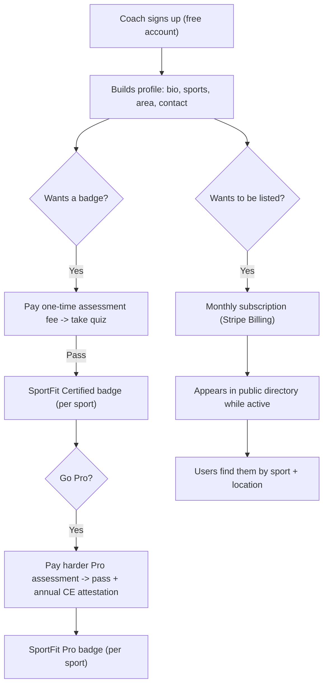

# SportFit - Coach Directory, Badges, Assessments, Subscriptions

Design only. The paid, server-backed side of SportFit: how coaches get listed,
earn credibility badges, and pay; and the trust rules that keep it honest. Read
[01-Architecture.md](01-Architecture.md) for where this sits in the system.

---

## 1. The model in one picture

**Two independent levers, kept visibly separate:**
- **Competence** = badges, earned only by passing assessments. Cannot be bought
  directly; you pay to *attempt*, not to *pass*.
- **Visibility** = a directory listing, bought by subscription.

A coach can be listed with no badge (shown plainly as "not yet certified"), or
badged but not currently listed. The UI never lets "paid" read as "qualified."
This separation is the core trust rule; see section 6.

## 2. Personas (coach side)

- **The solo local pro.** A cycling fitter, running coach, or lifting trainer
  who wants nearby clients to find them. Wants a cheap, credible listing and a
  badge that means something. Price-sensitive.
- **The studio/shop.** Multiple coaches, wants presence. Later: team accounts
  (out of scope now).
- **The skeptic.** Suspicious of "pay for a badge" schemes. Won by the
  competence/visibility separation and honest badge language.

## 3. The badges

Two tiers, sport-specific (a coach can be Certified in cycling and Pro in
running):

**SportFit Certified** (baseline, required to display any badge)
- Earned by passing a one-time paid **Certified assessment** for that sport: a
  multiple-choice quiz on the sport's fundamentals and on reading SportFit's
  analysis outputs responsibly.
- Purpose: a floor that filters for genuine baseline knowledge.

**SportFit Pro** (advanced)
- Requires Certified first, then passing a **harder Pro assessment** (deeper
  biomechanics, edge cases, safety and referral judgment).
- Plus an **annual continuing-education (CE) attestation**: the coach
  self-reports that they kept up (hours or activities), re-affirmed yearly. The
  badge shows "CE current" with a date, or lapses to a muted state when overdue.
- Purpose: a higher bar that rewards ongoing seriousness.

**Naming:** sport-neutral on purpose (see doc 00). The badge says "SportFit
Certified - Cycling"; the coach's own role word (fitter, coach, instructor,
trainer) is a separate profile field shown next to their name.

### Badge display and honesty
- A badge chip appears next to the coach's name in the directory and profile.
- Tapping it opens plain-language "what this means": passed SportFit's
  [tier] assessment for [sport] on [date]; for Pro, CE self-reported current as
  of [date]. And explicitly what it is **not**: not a government license, not a
  medical qualification, not a SportFit guarantee of the individual.
- Un-badged listed coaches show a neutral "Not yet SportFit certified" so the
  absence is legible, not hidden.

## 4. The assessment engine

- **Content model:** a versioned quiz per (sport, tier). Questions are
  multiple-choice with one or more correct answers, a pass threshold, and a
  question bank larger than any single attempt draws from (so retakes are not
  memorization). Content lives server-side; a coach never receives the answer
  key.
- **Flow:** coach pays the one-time fee (Stripe Checkout) -> the server unlocks
  an attempt -> quiz is taken in-app -> server scores it -> pass issues the
  badge, fail explains and offers a retake (with a cool-down and, per your
  call, a retake fee). Scoring happens server-side; the client is never trusted
  with pass/fail.
- **Anti-gaming:** randomized question subset, server-side scoring, a cool-down
  between attempts, and answer content never sent to the client unscored.
- **You author the questions.** The engine is generic; the question banks are
  content you (and per-sport experts) write. Treat authoring as its own task
  per sport; the first expert who helps author is a natural Pro relationship.

## 5. The directory and subscriptions

- **Public directory** at `/coaches`: search by sport and location (city/region
  text plus a radius on lat/lng), filter by badge tier. Each result shows name,
  role word, sports, badges, service area, and a contact/booking link the coach
  provides (SportFit hands off; it does not broker the session).
- **Coach profile** at `/coaches/[id]`: bio, sports, badges (with the honesty
  popovers), area, contact link, optional photo.
- **Listing visibility = active subscription.** Stripe Billing; a verified
  webhook flips listing status. Lapse or cancel hides the listing immediately
  but preserves the account, profile draft, badges, and history, so re-
  subscribing restores everything. Never delete a coach's earned badge because
  a subscription lapsed; competence is not rented.
- **Geo search** is the one consumer-facing feature that wants a light server
  read (or a periodically-built static index). Keep it cheap; it does not need
  the heavy path.

## 6. Trust, safety, legal (the part that protects you)

This is where an expansion like this goes wrong if rushed. Rules:

1. **Competence and visibility stay separate in every surface.** Never a
   bundle that reads "pay $X, get listed and badged." Assessment fees buy an
   attempt; subscription buys a listing; passing is the only way to a badge.
2. **Badges are described honestly and modestly.** Always: what it is (passed
   SportFit's assessment), when, and what it is not (not a license, not medical
   certification, not a personal guarantee). CE is always labeled
   "self-reported."
3. **The directory is labeled paid advertising** where that matters, and coach
   independence is explicit: coaches are independent professionals; SportFit
   lists them, does not employ, supervise, or guarantee them, and does not vet
   beyond the assessment.
4. **User-side liability.** Following any form/technique suggestion is at the
   user's own risk; the strengthened not-a-substitute-for-a-pro-or-physician
   disclaimer applies, and is heaviest on lifting and gait.
5. **Privacy for new server data.** Coach PII, payment metadata, assessment
   answers, and attestations are protected by RLS (`auth.uid()` scoping),
   never exposed cross-user, and covered in an updated `/privacy`. Assessment
   answers and payment details are private to the coach and the server.
6. **Play billing.** Coach payment flows are **hidden in the Play-wrapped app**
   (reuse the `?src=play` mechanism), so the Android app stays a free consumer
   tool; coaches transact on the website.
7. **Get a lawyer before launch** for the badge claims, coach terms of service,
   advertising disclosures, user waivers, and privacy. I can draft plain-
   language versions; they are not legal advice.

## 7. Build note

This whole side is the heaviest and riskiest (payments, RLS, quiz integrity,
legal), so the build plan (doc 05) sequences it **after** the sports prove the
free funnel is popular. Ship the directory read-only and free first, then
badges, then subscriptions, then Pro + CE. Every payment and state-change path
gets the DamageIQ-grade server security review.
